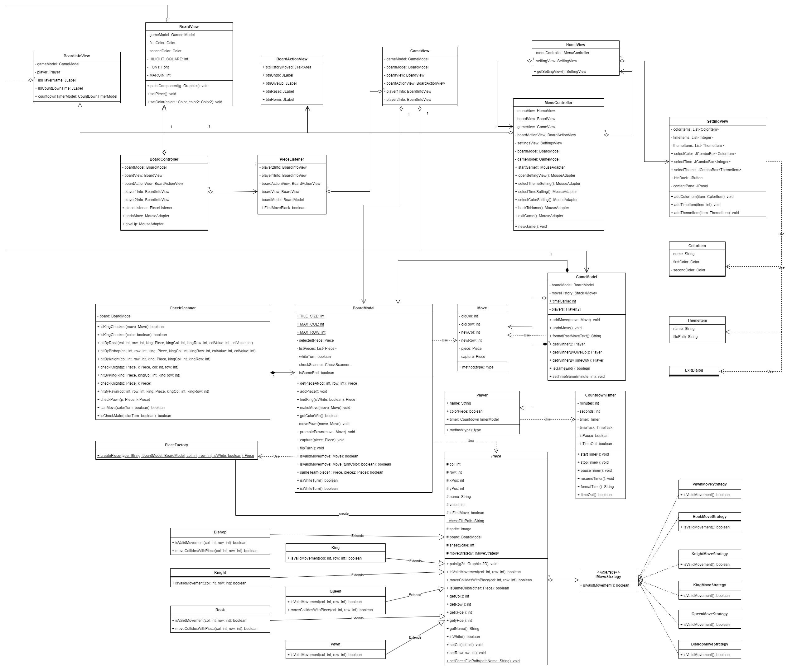

# WELCOME TO JAVA CHESS GAME

## **Introduce**

This is my end-of-semester project for the Object-Oriented Design course in the second semester of my second year at university. It involves applying object-oriented programming principles and utilizing Java to develop this game, incorporating various *Design Patterns*. 

## The design patterns used in this project are as follows:

 - **Strategy pattern**: applied in creating strategies and movement patterns for each chess piece.
 - **Factory method**: utilized in creating chess pieces in an easy and convenient manner.
 - **MVC pattern:** separates concerns, organizes code, promotes reusability, enables easier testing, and provides flexibility in user interface development.

## Class Diagram:

...

© 2023 DangCaoHoangTuan.